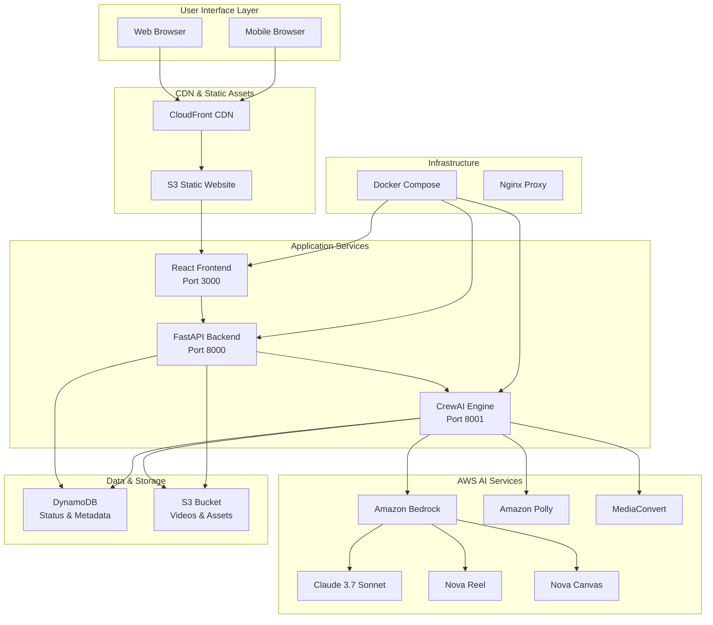
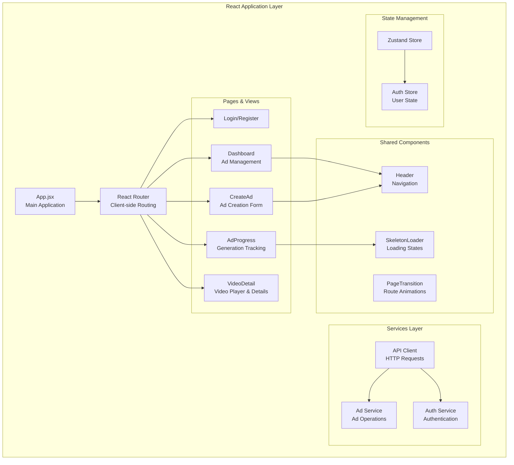
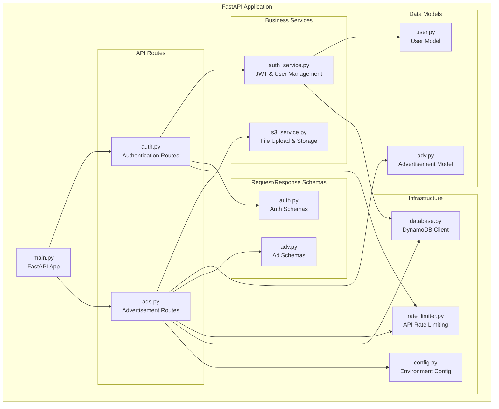
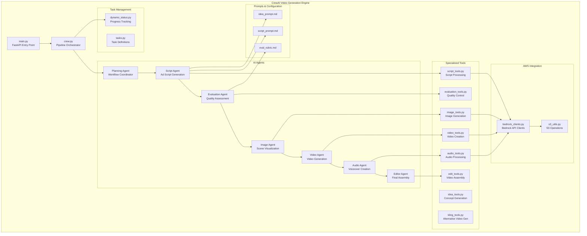
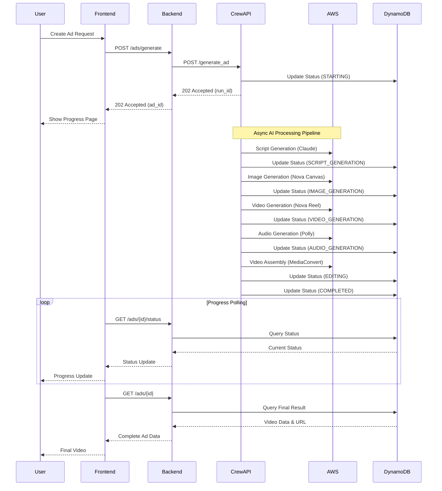
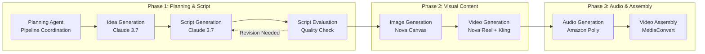
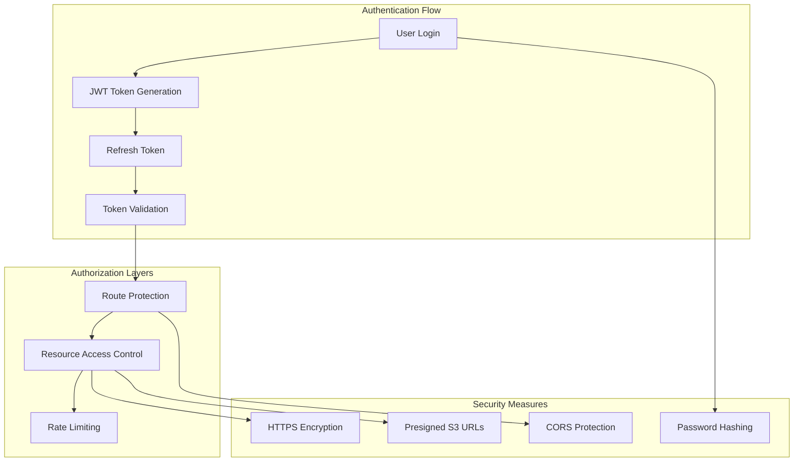
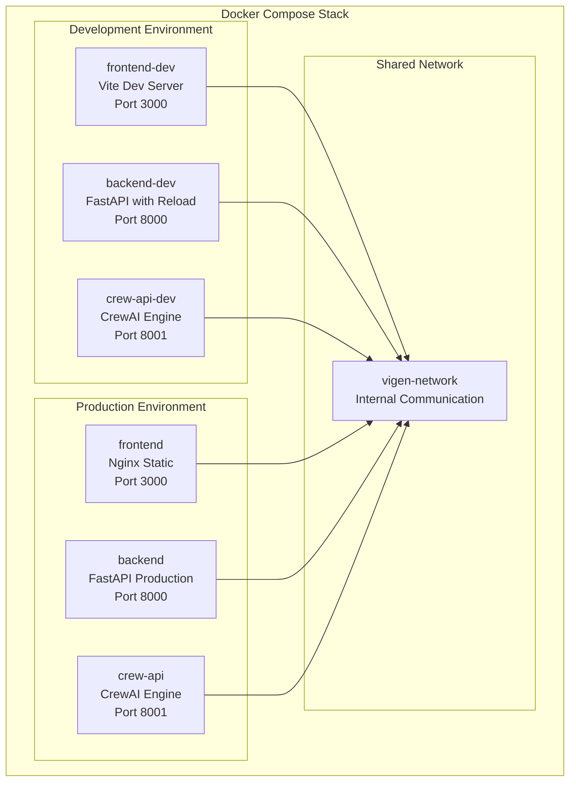

# 🏗️ Vigen AI - Complete Platform Architecture

## 📋 Table of Contents
- [System Overview](#system-overview)
- [High-Level Architecture](#high-level-architecture)
- [Component Architecture](#component-architecture)
- [Service Communication](#service-communication)
- [AI Processing Pipeline](#ai-processing-pipeline)
- [Data Architecture](#data-architecture)
- [Security Architecture](#security-architecture)
- [Deployment Architecture](#deployment-architecture)
- [Technology Stack](#technology-stack)
- [Scalability & Performance](#scalability--performance)

## 🎯 System Overview

Vigen AI is a comprehensive AI-powered video advertisement generation platform that transforms product descriptions into professional-quality video advertisements. The system combines a modern web application frontend with an advanced AI processing backend using Amazon Bedrock's latest multimodal models.

### Key Capabilities
- **Intelligent Script Generation**: AI-powered advertising script creation using Claude 3.7 Sonnet
- **Multi-Agent Workflow**: CrewAI orchestrated pipeline with specialized agents
- **Advanced Video Generation**: Amazon Nova Reel for high-quality video synthesis
- **Scene Visualization**: Nova Canvas for photorealistic scene generation
- **Voice Synthesis**: Amazon Polly for natural-sounding voiceovers
- **Automated Editing**: AWS MediaConvert for professional video assembly
- **Real-time Tracking**: Live progress monitoring and status updates

## 🏗️ High-Level Architecture



## 🧩 Component Architecture

### 1. Frontend Architecture (React + Vite)



### 2. Backend Architecture (FastAPI)



### 3. CrewAI Engine Architecture



## 🔄 Service Communication

### Inter-Service Communication Flow



### API Communication Patterns

#### 1. Frontend ↔ Backend Communication
```typescript
// Polling-based status updates
const pollAdStatus = async (adId: string) => {
  const response = await fetch(`/api/ads/${adId}/status`);
  return response.json();
};

// RESTful resource operations
const createAd = async (adData: CreateAdRequest) => {
  const response = await fetch('/api/ads/generate', {
    method: 'POST',
    headers: { 'Content-Type': 'application/json' },
    body: JSON.stringify(adData)
  });
  return response.json();
};
```

#### 2. Backend ↔ CrewAPI Communication
```python
# Async job initiation
async def trigger_video_generation(ad_data: dict) -> str:
    crew_response = await httpx.post(
        f"{CREW_ENDPOINT_URL}/generate_ad",
        json={
            "name": ad_data["name"],
            "desc": ad_data["description"],
            "run_id": ad_data["run_id"]
        }
    )
    return crew_response.json()["run_id"]
```

## 🤖 AI Processing Pipeline

### Multi-Agent Workflow



### AI Model Integration

#### 1. Amazon Bedrock Models
- **Claude 3.7 Sonnet**: Script generation, evaluation, and text processing
- **Nova Reel**: High-quality video generation from text prompts
- **Nova Canvas**: Photorealistic image generation for scene creation

#### 2. AWS Media Services
- **Amazon Polly**: Neural voice synthesis for voiceovers
- **MediaConvert**: Professional video editing and assembly
- **S3**: Secure media storage with presigned URLs

#### 3. Processing Workflow
```python
# Example pipeline execution
def run_video_generation_pipeline(product_name: str, product_desc: str, run_id: str):
    # 1. Generate creative concept
    idea = generate_ad_idea(product_name, product_desc)
    
    # 2. Create advertising script
    script = generate_script(idea, product_name, product_desc)
    
    # 3. Evaluate script quality
    evaluation = evaluate_script(script)
    
    # 4. Generate scene images
    images = generate_scene_images(script)
    
    # 5. Create video clips
    videos = generate_video_clips(script, images)
    
    # 6. Generate voiceover
    audio = generate_voiceover(script)
    
    # 7. Assemble final video
    final_video = assemble_video(videos, audio)
    
    return final_video
```

## 💾 Data Architecture

### Database Schema (DynamoDB)

#### 1. Users Table
```python
{
    "email": "user@example.com",           # Partition Key
    "user_id": "uuid-string",
    "password_hash": "bcrypt-hash",
    "full_name": "User Name",
    "created_at": "2024-01-01T00:00:00Z",
    "is_active": True
}
```

#### 2. Advertisements Table
```python
{
    "ad_id": "uuid-string",                # Partition Key
    "user_email": "user@example.com",     # GSI Partition Key
    "title": "Product Advertisement",
    "description": "Product description",
    "status": "completed",                 # ENUM: pending, processing, completed, failed
    "run_id": "crew-api-run-id",
    "video_url": "https://s3.../video.mp4",
    "created_at": "2024-01-01T00:00:00Z",
    "updated_at": "2024-01-01T00:00:00Z",
    "metadata": {
        "script": "Generated script text",
        "processing_time": 300,
        "file_size": 1024000
    }
}
```

#### 3. Generation Status Table (CrewAPI)
```python
{
    "run_id": "crew-run-uuid",             # Partition Key
    "status": "VIDEO_GENERATION",          # Current step
    "progress": 60,                        # Percentage complete
    "current_step": "Generating video clips",
    "steps_completed": ["SCRIPT_GENERATION", "IMAGE_GENERATION"],
    "error_message": None,
    "artifacts": {
        "script_url": "s3://bucket/script.json",
        "images": ["s3://bucket/img1.jpg", "s3://bucket/img2.jpg"],
        "videos": ["s3://bucket/clip1.mp4"],
        "audio_url": "s3://bucket/voiceover.mp3"
    },
    "created_at": "2024-01-01T00:00:00Z",
    "updated_at": "2024-01-01T00:00:00Z"
}
```

### Storage Architecture (S3)

```
s3://vigen-ai-storage/
├── videos/
│   ├── final/          # Completed advertisement videos
│   ├── clips/          # Generated video clips
│   └── temp/           # Temporary processing files
├── images/
│   ├── scenes/         # Generated scene images
│   └── thumbnails/     # Video thumbnails
├── audio/
│   ├── voiceovers/     # Generated speech
│   └── music/          # Background music
├── scripts/
│   └── generated/      # AI-generated scripts
└── logs/
    └── processing/     # Pipeline execution logs
```

## 🔒 Security Architecture

### Authentication & Authorization



### Security Features

#### 1. Authentication Security
- **JWT Tokens**: Secure, stateless authentication
- **Refresh Tokens**: Extended session management
- **Password Hashing**: bcrypt with salt rounds
- **Session Management**: Automatic token expiration

#### 2. API Security
- **Rate Limiting**: Per-user and IP-based limits
- **CORS Protection**: Configured allowed origins
- **Input Validation**: Pydantic schema validation
- **Error Handling**: Secure error messages

#### 3. Data Security
- **Encryption in Transit**: HTTPS/TLS for all communications
- **Encryption at Rest**: S3 and DynamoDB encryption
- **Presigned URLs**: Temporary, secure media access
- **Access Control**: IAM roles and policies

## 🚀 Deployment Architecture

### Container Orchestration



### Environment Configuration

#### 1. Development Environment
```yaml
# docker-compose.dev.yml
services:
  frontend-dev:
    build: 
      context: ./app/frontend
      dockerfile: Dockerfile.dev
    ports: ["3000:3000"]
    volumes: ["./app/frontend/src:/app/src"]
    
  backend-dev:
    build:
      context: ./app/backend
      dockerfile: Dockerfile.dev
    ports: ["8000:8000"]
    environment:
      - CREW_ENDPOINT_URL=http://crew-api-dev:8001
    
  crew-api-dev:
    build:
      context: ./crew-api
      dockerfile: dockerfile.dev
    ports: ["8001:8001"]
```

#### 2. Production Environment
```yaml
# docker-compose.yml
services:
  frontend:
    build: ./app/frontend
    ports: ["3000:80"]
    
  backend:
    build: ./app/backend
    ports: ["8000:8000"]
    environment:
      - CREW_ENDPOINT_URL=http://crew-api:8001
    
  crew-api:
    build: ./crew-api
    ports: ["8001:8001"]
```

### Deployment Strategies

#### 1. Local Development
```bash
# Start development environment
make dev
# or
./start-dev.ps1

# Individual service management
docker-compose -f docker-compose.dev.yml up frontend-dev
docker-compose -f docker-compose.dev.yml logs -f backend-dev
```

#### 2. Production Deployment
```bash
# Production deployment
make prod
# or
docker-compose up -d

# Health monitoring
docker-compose ps
docker-compose logs
```

#### 3. Cloud Deployment Options
- **AWS ECS**: Container orchestration with auto-scaling
- **AWS EC2**: Direct container deployment
- **AWS Lambda**: Serverless functions for API endpoints
- **S3 + CloudFront**: Static frontend hosting with CDN

## 🛠️ Technology Stack

### Frontend Stack
- **Framework**: React 18 with TypeScript
- **Build Tool**: Vite for fast development and building
- **Styling**: Tailwind CSS for utility-first styling
- **State Management**: Zustand for lightweight state management
- **Routing**: React Router for client-side navigation
- **HTTP Client**: Fetch API with custom service layer
- **UI Components**: Custom components with dark theme

### Backend Stack
- **Framework**: FastAPI for high-performance Python API
- **Database**: Amazon DynamoDB for NoSQL data storage
- **Storage**: Amazon S3 for media file storage
- **Authentication**: JWT tokens with bcrypt password hashing
- **Validation**: Pydantic for request/response validation
- **Rate Limiting**: Custom rate limiter with Redis-like caching
- **Documentation**: Auto-generated OpenAPI/Swagger docs

### AI/ML Stack
- **Orchestration**: CrewAI for multi-agent workflow management
- **LLM**: Claude 3.7 Sonnet via Amazon Bedrock
- **Video Generation**: Amazon Nova Reel + Kling AI
- **Image Generation**: Amazon Nova Canvas
- **Voice Synthesis**: Amazon Polly with neural voices
- **Video Processing**: AWS MediaConvert for editing and assembly
- **Workflow Management**: Custom task orchestration

### Infrastructure Stack
- **Containerization**: Docker and Docker Compose
- **Cloud Provider**: Amazon Web Services (AWS)
- **CDN**: CloudFront for static asset delivery
- **Monitoring**: CloudWatch for logging and metrics
- **Security**: IAM for access control, KMS for encryption
- **Networking**: VPC for secure cloud networking

## 📈 Scalability & Performance

### Performance Optimization

#### 1. Frontend Performance
```typescript
// Code splitting and lazy loading
const Dashboard = lazy(() => import('./pages/Dashboard'));
const CreateAd = lazy(() => import('./pages/CreateAd'));

// Optimized polling with exponential backoff
const usePolling = (adId: string, interval = 2000) => {
  const [status, setStatus] = useState(null);
  
  useEffect(() => {
    const poll = async () => {
      try {
        const response = await fetchAdStatus(adId);
        setStatus(response);
        
        if (response.status === 'completed') {
          clearInterval(timer);
        }
      } catch (error) {
        // Exponential backoff on error
        interval = Math.min(interval * 1.5, 30000);
      }
    };
    
    const timer = setInterval(poll, interval);
    return () => clearInterval(timer);
  }, [adId, interval]);
};
```

#### 2. Backend Performance
```python
# Async request handling
@router.post("/ads/generate")
async def generate_ad(
    ad_data: CreateAdRequest,
    background_tasks: BackgroundTasks,
    current_user: User = Depends(get_current_user)
):
    # Async job initiation
    background_tasks.add_task(process_ad_generation, ad_data)
    return {"status": "accepted", "ad_id": ad_data.ad_id}

# Connection pooling for DynamoDB
@lru_cache()
def get_dynamodb_client():
    return boto3.resource('dynamodb', region_name='us-east-1')
```

#### 3. AI Pipeline Performance
```python
# Parallel processing for independent tasks
async def generate_scene_content(scenes: List[Scene]) -> List[SceneContent]:
    tasks = []
    for scene in scenes:
        # Run image and video generation in parallel
        image_task = asyncio.create_task(generate_scene_image(scene))
        video_task = asyncio.create_task(generate_scene_video(scene))
        tasks.extend([image_task, video_task])
    
    results = await asyncio.gather(*tasks)
    return process_results(results)
```

### Scalability Strategies

#### 1. Horizontal Scaling
- **Container Scaling**: Multiple instances behind load balancer
- **Database Scaling**: DynamoDB auto-scaling for read/write capacity
- **Storage Scaling**: S3 automatic scaling for media files
- **CDN Scaling**: CloudFront global edge locations

#### 2. Vertical Scaling
- **CPU Optimization**: Multi-core processing for AI workflows
- **Memory Optimization**: Efficient data structures and caching
- **GPU Acceleration**: EC2 GPU instances for AI model inference
- **Storage Optimization**: SSD storage for faster I/O operations

#### 3. Caching Strategies
```python
# Redis caching for frequently accessed data
@lru_cache(maxsize=1000)
def get_user_preferences(user_id: str) -> UserPreferences:
    return fetch_from_database(user_id)

# S3 caching for generated assets
def cache_generated_content(content_type: str, content_data: bytes) -> str:
    cache_key = f"cache/{content_type}/{hash(content_data)}"
    s3_client.put_object(Bucket=CACHE_BUCKET, Key=cache_key, Body=content_data)
    return cache_key
```

### Monitoring & Observability

#### 1. Application Metrics
- **Response Times**: API endpoint performance tracking
- **Success Rates**: Request success/failure monitoring
- **User Activity**: Feature usage analytics
- **Error Tracking**: Exception monitoring and alerting

#### 2. Infrastructure Metrics
- **Container Health**: CPU, memory, and disk usage
- **Network Performance**: Latency and throughput monitoring
- **Database Performance**: Query performance and capacity
- **Storage Metrics**: S3 request rates and transfer volumes

#### 3. AI Pipeline Metrics
- **Generation Times**: Time per pipeline stage
- **Quality Scores**: AI output quality assessment
- **Resource Utilization**: GPU and CPU usage during processing
- **Cost Tracking**: AWS service usage and billing

---

## 🎯 Conclusion

Vigen AI represents a sophisticated, production-ready platform that combines modern web development practices with cutting-edge AI capabilities. The architecture supports:

- **Scalable Growth**: From prototype to enterprise-scale deployment
- **High Performance**: Optimized for both user experience and AI processing
- **Security First**: Comprehensive security measures throughout the stack
- **Developer Experience**: Clear separation of concerns and maintainable code
- **Cost Efficiency**: Optimized resource usage and pay-as-you-scale model

The platform is designed to evolve with advancing AI technologies while maintaining stability and user experience excellence.