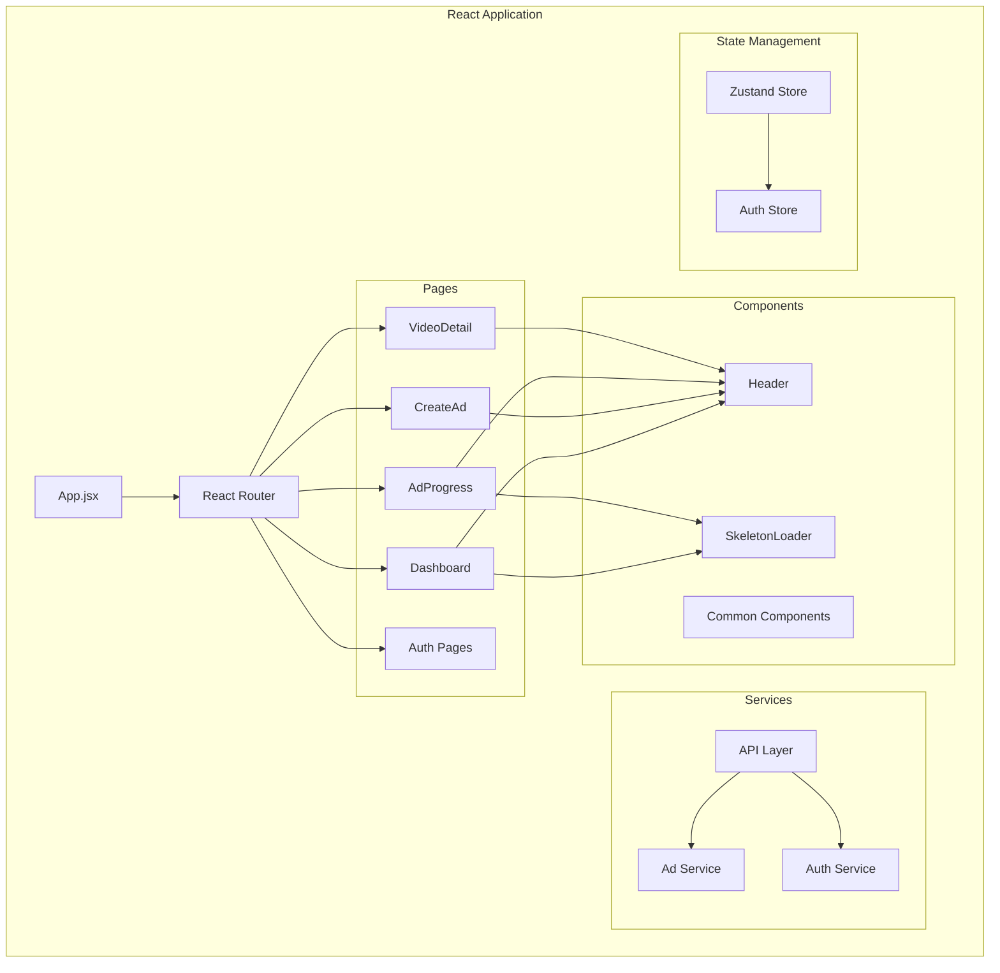

# 🏗️ Vigen AI - Architecture Documentation

## 📋 Table of Contents
- [System Overview](#system-overview)
- [Architecture Patterns](#architecture-patterns)
- [Component Architecture](#component-architecture)
- [Data Flow](#data-flow)
- [Security Architecture](#security-architecture)
- [Deployment Architecture](#deployment-architecture)
- [API Design](#api-design)
- [Database Schema](#database-schema)
- [Performance Considerations](#performance-considerations)
- [Scalability Strategy](#scalability-strategy)

## 🎯 System Overview

Vigen AI is a modern web application that leverages AI to generate professional video advertisements. The system follows a **microservices architecture** with clear separation of concerns between frontend, backend, AI processing, and data storage layers.

### High-Level Architecture


## 🔧 Architecture Patterns

### 1. **Layered Architecture**

```
┌─────────────────────────────────────────┐
│           Presentation Layer            │
│    (React Components, State Management) │
├─────────────────────────────────────────┤
│             Service Layer               │
│     (API Services, Business Logic)     │
├─────────────────────────────────────────┤
│            Controller Layer             │
│        (FastAPI Routes, Validation)     │
├─────────────────────────────────────────┤
│             Business Layer              │
│       (Domain Models, Use Cases)       │
├─────────────────────────────────────────┤
│             Data Access Layer           │
│    (DynamoDB Service, S3 Service)      │
└─────────────────────────────────────────┘
```

### 2. **Event-Driven Architecture**
- **Polling-based Updates**: Frontend polls backend for status updates
- **Async Processing**: AI video generation runs asynchronously
- **State Synchronization**: Real-time progress tracking across components

### 3. **RESTful API Design**
- **Resource-based URLs**: `/ads/{id}`, `/auth/login`
- **HTTP Verbs**: GET, POST, PUT, DELETE
- **Standardized Responses**: Consistent JSON structure
- **Status Codes**: Proper HTTP status code usage

## 🧩 Component Architecture

### Frontend Architecture (React + Vite)



### Backend Architecture (FastAPI)


## 🔄 Data Flow

### Video Generation Workflow


### Authentication Flow


## 🔐 Security Architecture

### Authentication & Authorization


### Security Measures

1. **Rate Limiting**
   ```python
   # Authentication endpoints: 3-5 requests per 5 minutes
   @rate_limit(max_requests=5, window_seconds=300)
   
   # Status polling: 15 requests per second
   @rate_limit(max_requests=15, window_seconds=1)
   
   # General operations: 10-30 requests per minute
   @rate_limit(max_requests=20, window_seconds=60)
   ```

2. **JWT Security**
   - Access tokens: 24-hour expiration
   - Refresh tokens: 7-day expiration
   - Secure token storage in frontend
   - Automatic token refresh

3. **S3 Security**
   - Presigned URLs with 15-minute expiration
   - User-specific path validation
   - File type restrictions
   - Object existence verification

4. **Input Validation**
   - Pydantic schema validation
   - SQL injection prevention
   - XSS protection
   - Path traversal prevention

## 🚀 Deployment Architecture

### Development Environment


### Production Environment


### Docker Architecture

```dockerfile
# Multi-stage build for frontend
FROM node:18-alpine AS build
WORKDIR /app
COPY package*.json ./
RUN npm ci
COPY . .
RUN npm run build

FROM nginx:alpine
COPY --from=build /app/dist /usr/share/nginx/html
COPY nginx.conf /etc/nginx/conf.d/default.conf
```

```dockerfile
# Backend container
FROM python:3.11-slim
WORKDIR /app
COPY requirements.txt .
RUN pip install -r requirements.txt
COPY . .
CMD ["uvicorn", "app.main:app", "--host", "0.0.0.0", "--port", "8000"]
```

## 📡 API Design

### RESTful Endpoints

```yaml
# Authentication API
/auth:
  /register:
    POST: Register new user
  /login:
    POST: User login
  /refresh:
    POST: Refresh access token
  /me:
    GET: Get current user info

# Advertisement API  
/ads:
  /:
    GET: List user ads
    POST: Create new ad
  /{run_id}:
    GET: Get specific ad
    PUT: Update ad
  /{run_id}/status:
    GET: Get generation status (polling)
  /{run_id}/video-url:
    GET: Get presigned video URL
```

### Response Schemas

```python
# Advertisement Response
class AdvertisementResponse(BaseModel):
    run_id: str
    name: str
    desc: str
    status: AdvStatus
    final_video_uri: Optional[str]
    created_at: datetime
    updated_at: datetime

# Status Response
class AdvertisementStatusResponse(BaseModel):
    run_id: str
    status: AdvStatus
    crew_status: Optional[dict]  # Full crew API status

# Error Response
class ErrorResponse(BaseModel):
    detail: str
    error_code: Optional[str]
    timestamp: datetime
```

## 🗄️ Database Schema

### DynamoDB Tables

#### Users Table
```python
{
    "user_id": "uuid",           # Partition Key
    "email": "string",           # Unique
    "full_name": "string",
    "role": "string",
    "password_hash": "string",
    "created_at": "timestamp",
    "updated_at": "timestamp"
}
```

#### Advertisements Table
```python
{
    "user_id": "string",         # Partition Key
    "run_id": "string",          # Sort Key
    "name": "string",
    "desc": "string", 
    "status": "string",          # ENUM: IN_PROGRESS, GENERATED, FAILED
    "final_video_uri": "string", # S3 URI
    "created_at": "timestamp",
    "updated_at": "timestamp"
}

# Global Secondary Index (GSI)
"status-index": {
    "partition_key": "status",
    "sort_key": "created_at"
}
```

### Data Access Patterns

```python
# Get user's advertisements
query(
    KeyConditionExpression=Key('user_id').eq(user_id)
)

# Get specific advertisement
get_item(
    Key={'user_id': user_id, 'run_id': run_id}
)

# Query by status (using GSI)
query(
    IndexName='status-index',
    KeyConditionExpression=Key('status').eq('GENERATED')
)
```

## ⚡ Performance Considerations

### Frontend Optimizations

1. **Code Splitting**
   ```javascript
   // Vite automatic code splitting
   manualChunks: {
     vendor: ['react', 'react-dom', 'react-router-dom'],
     ui: ['lucide-react', '@radix-ui/react-dialog']
   }
   ```

2. **Lazy Loading**
   ```javascript
   const VideoDetail = lazy(() => import('./pages/VideoDetail'));
   const CreateAd = lazy(() => import('./pages/CreateAd'));
   ```

3. **State Management**
   - Zustand for minimal state management
   - Local state for component-specific data
   - Efficient re-rendering with React patterns

### Backend Optimizations

1. **Database Queries**
   - DynamoDB single-table design
   - Efficient access patterns
   - Minimal data fetching

2. **Caching Strategy**
   ```python
   # Presigned URL caching
   @lru_cache(maxsize=1000)
   def generate_presigned_url(object_key: str) -> str:
       return s3_service.generate_presigned_download_url(object_key)
   ```

3. **Rate Limiting**
   - In-memory sliding window
   - User-specific and IP-based limits
   - Configurable thresholds

### S3 Optimizations

1. **CloudFront Integration**
   - Global content delivery
   - Edge caching
   - Custom error pages for SPA routing

2. **Presigned URLs**
   - Short expiration times (15 minutes)
   - Path validation
   - Object existence checks

## 📈 Scalability Strategy

### Horizontal Scaling


### Microservices Evolution


### Caching Strategy


## 🔍 Monitoring & Observability

### Logging Strategy

```python
# Structured JSON logging
logger.info("Generated presigned URL", extra={
    "user_id": current_user.email,
    "ad_id": run_id,
    "s3_key": key,
    "expiration": 900,
    "timestamp": datetime.utcnow().isoformat()
})
```

### Health Checks

```python
@app.get("/health")
async def health_check():
    return {
        "status": "healthy",
        "timestamp": datetime.utcnow(),
        "version": "1.0.0",
        "services": {
            "database": await check_dynamodb(),
            "storage": await check_s3(),
            "crew_ai": await check_crew_service()
        }
    }
```

### Metrics Collection

- **Application Metrics**: Request rates, response times, error rates
- **Business Metrics**: Ad creation rates, completion rates, user engagement
- **Infrastructure Metrics**: CPU, memory, disk usage, network I/O
- **Custom Metrics**: Rate limiting hits, S3 operations, DynamoDB usage

---

This architecture documentation provides a comprehensive overview of the Vigen AI platform's technical implementation, design decisions, and scalability considerations. The system is designed to be maintainable, scalable, and secure while delivering a high-quality user experience.